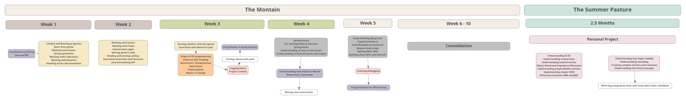

This repository is your go-to place for all information during the Java course.  
Clone it on your computer and `git pull` regularly in order to fetch the latest updates made by your coaches.

## ➡️ What's coming

## 👩‍🎓 Briefings

Here is a chronological list of projects, in the order they were tackled by your startup.

### ⛰️ The mountain

- [Week 1](./week_1/readme.md)
- [Week 2](./week_2/readme.md)
- [Week 3](./week_3/readme.md)
- [Week 4](./week_4/readme.md)
- [Week 5](./week_5/readme.md)
- [Week 6 - 10](./week_6-10/readme.md)

### 🚠 Summer pastures 

- [Summer pastures](./summer_pastures/last_project.md)

And remember, we NEVER give up! ;)
